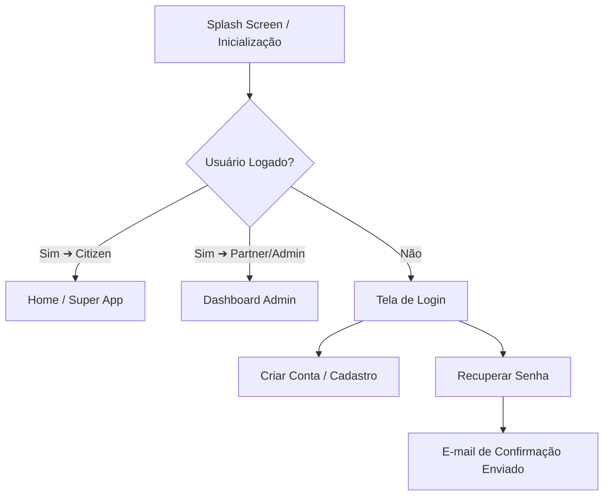
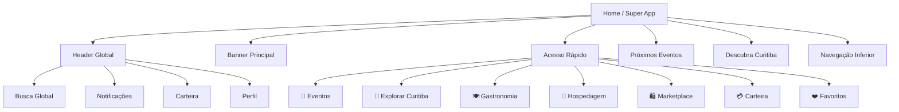
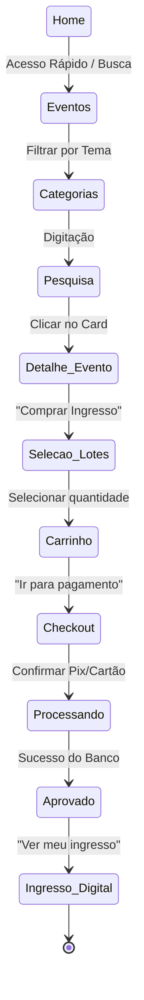
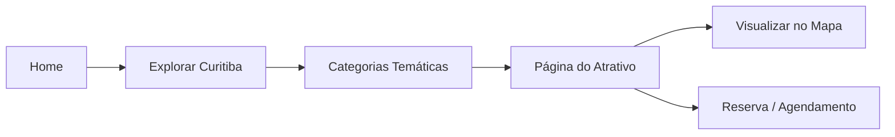
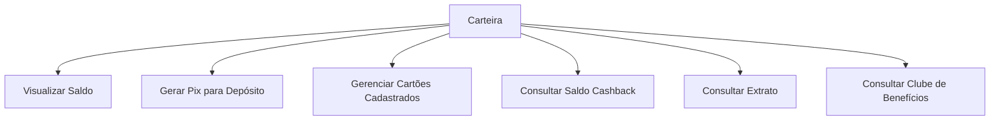
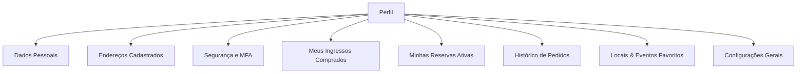
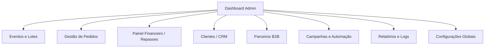

# 🔄 Mapa Mestre de Navegação — Curitiba 360

Este documento detalha a árvore de navegação completa e os fluxos de transição de tela para os ambientes mobile (**Super App**) e desktop (**Painel Administrativo**).

---

## 📱 1. Fluxo de Abertura do Aplicativo

Quando o usuário abre o aplicativo, a verificação de autenticação é executada para definir o destino imediato.

---

## 🏠 2. Hub Inteligente (Home)

A Home atua como ponto de partida (Hub) para todas as seções internas do Super App.

---

## 🎟️ 3. Fluxo de Eventos e Ingressos (MVP)

A jornada linear de compra de ingressos até a validação de acesso.

---

## 🗺️ 4. Fluxo de Turismo e Atrativos

Como o usuário explora a cidade de Curitiba e realiza reservas.

*Categorias de Turismo mapeadas:*
* **Parques** (ex: Barigui, Tanguá, Jardim Botânico)
* **Museus** (ex: MON, Museu Paranaense)
* **Feiras** (ex: Feira do Largo da Ordem)
* **Igrejas** (ex: Catedral de Curitiba)
* **Gastronomia** (ex: Bairros de Santa Felicidade)
* **Compras** (ex: Shoppings e Galerias)
* **Passeios** (ex: Linha Turismo)

---

## 💳 5. Fluxo da Carteira (Wallet)

Gerenciamento de saldo, histórico e cashback.

---

## 👤 6. Fluxo de Perfil do Usuário

Configurações e informações do participante.

---

## 🖥️ 7. Navegação do Painel Administrativo (Admin Console)

O console administrativo é isolado e gerencia o marketplace, finanças e cadastros.

