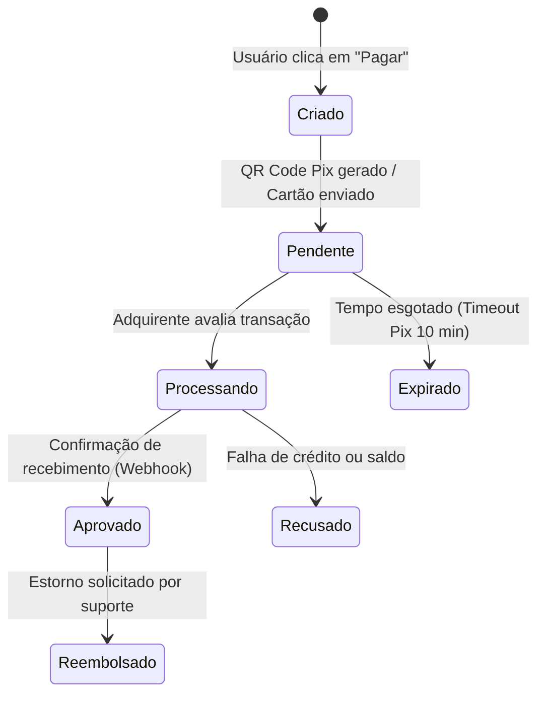

# 💳 Arquitetura de Pagamentos & Reembolsos — Curitiba 360

Este documento reúne a especificação técnica dos fluxos de transações financeiras, conciliações e segurança de dados de pagamentos na plataforma.

---

## 🔄 1. Fluxo de Compra e Estados do Pedido

A máquina de estados para todas as transações financeiras é gerida centralmente no backend para evitar fraudes ou inconsistências locais:

---

## 🛡️ 2. Regras de Segurança (PCI-DSS Compliance)

* **Segurança de Dados do Cartão**: Nenhum número de cartão de crédito completo ou código verificador (CVV) é transmitido diretamente ou gravado no banco de dados local. A criptografia e tokenização ocorrem diretamente no SDK do provedor de pagamento (ex: Stripe ou adquirente parceiro) no frontend.
* **Validação Transacional**: Os cálculos de taxas e preços finais de carrinho são recalculados e validados no servidor antes do envio da ordem de pagamento, prevenindo tentativas de manipulação de requisições no frontend.

---

## ⚡ 3. Webhooks & Split Financeiro (B2B)

* **Garantia de Entrega (Webhooks)**: As confirmações de pagamento dependem exclusivamente da resposta assíncrona enviada pelo gateway de pagamento ao endpoint de webhook `/api/v1/payments/webhook`, prevenindo inconsistências causadas por fechamento acidental de abas pelo usuário.
* **Divisão de Tarifas (Split)**: As transações aprovadas passam pelo processo automático de divisão de repasses:
  * **Taxa da Plataforma**: Retenção automática de comissão (ex: 8% a 12%).
  * **Comissão de Afiliados/Agências**: Encaminhamento direto de percentual contratual configurado.
  * **Produtor/Parceiro**: Crédito líquido do saldo para retirada.
