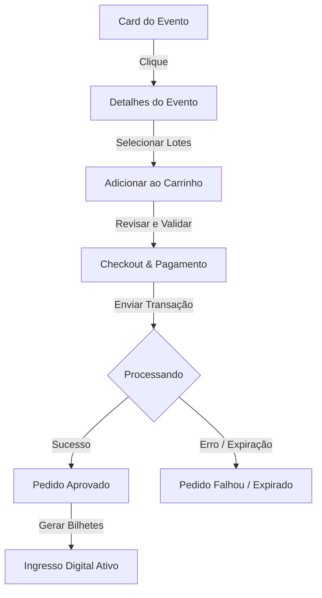
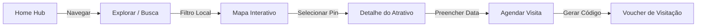
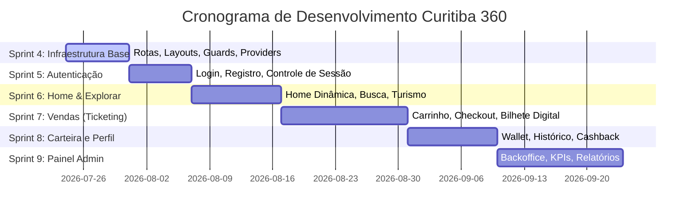

# 📐 Blueprint Técnico — Curitiba 360

Este é o documento oficial de referência arquitetural e de engenharia para o desenvolvimento do **Curitiba 360**. Ele define os padrões de design, diretrizes de modelagem de dados, mapeamento de responsabilidades de código e o plano tático de entregas.

---

## 🏛️ 1. Arquitetura do Projeto em Camadas

A plataforma segue um desacoplamento estrito em 5 camadas para assegurar testabilidade, reutilização e facilidade de substituição de infraestrutura (como banco de dados e APIs externas):

```text
               Nível 1: Interface (UI)
                          │
                          ▼
                Nível 2: Hooks (Estado)
                          │
                          ▼
                Nível 3: Services (Regras)
                          │
                          ▼
             Nível 4: Repositories (Dados)
                          │
                          ▼
              Nível 5: Provedor (Firebase)
```

### Detalhamento das Responsabilidades
1. **Camada 1: Interface (JSX/TSX)**: Responsável unicamente pela renderização visual, manipulação de estados locais simples (ex: toggle de visibilidade), responsividade e acessibilidade. **Não deve conter nenhuma regra de negócio**.
2. **Camada 2: Hooks de Estado (`hooks/`)**: Concentra a reatividade da tela, escuta de dados em tempo real e orquestração de chamadas de serviços.
3. **Camada 3: Services (`services/`)**: Centraliza as regras de negócio da aplicação (ex: validação de CPF, cálculo de descontos, controle de cashback). As telas e hooks consomem os serviços para executar mutações.
4. **Camada 4: Repositories (`repositories/`)**: Interface direta de leitura e gravação no banco de dados. Isola o Firestore do restante do código.
5. **Camada 5: Firebase / Firestore**: A infraestrutura física de nuvem.

---

## 📁 2. Estrutura de Diretórios e Convenção de Módulos

O repositório está organizado de forma modular. Cada funcionalidade de negócios (Ex: `events`, `wallet`) é encapsulada em seu próprio módulo autossuficiente:

```text
src/modules/nome-modulo/
 ├── components/       # Componentes exclusivos deste módulo
 ├── pages/            # Telas visíveis deste módulo
 ├── hooks/            # Custom hooks de orquestração local
 ├── services/         # Regras de negócios do módulo
 ├── repositories/     # Conexão Firestore do módulo
 ├── types/            # Tipos e interfaces TS/JS
 ├── schemas/          # Schemas de validação Zod
 ├── routes.jsx        # Sub-rotas associadas a este módulo
 └── index.js          # Exportação unificada pública do módulo
```

---

## 🔄 3. Fluxo de Navegação e Transição Funcional

### A. Fluxo de Compra de Ingressos (Ticketing)


### B. Fluxo de Agendamento Turístico


---

## 💾 4. Modelo de Dados e Esquema de Coleções

Todas as escritas no Firestore devem estar em conformidade com as regras de segurança e o esquema de coleções abaixo:

```text
/users (Coleção)
  └─ {uid} (Documento)
       ├── displayName: string
       ├── cpf: string (com validação e máscara)
       ├── email: string
       ├── role: "citizen" | "partner" | "admin"
       └── createdAt: timestamp

/events (Coleção)
  └─ {eventId} (Documento)
       ├── title: string
       ├── description: string
       ├── category: string
       ├── date: timestamp
       ├── location: { address: string, lat: number, lng: number }
       ├── pricing: { minPrice: number, maxPrice: number }
       ├── capacity: number
       └── partnerId: string

/orders (Coleção)
  └─ {orderId} (Documento)
       ├── userId: string
       ├── eventId: string
       ├── totalAmount: number
       ├── status: "created" | "pending" | "approved" | "cancelled" | "expired"
       └── items: Array<{ ticketType: string, quantity: number, price: number }>
```

---

## 🏃 5. Roadmap e Cronograma de Desenvolvimento

A implementação da arquitetura funcional ocorrerá nas seguintes Sprints estruturadas:



---

## ✅ 6. Checklist de Implementação e Critérios de Aceite

Para que uma tela ou funcionalidade seja considerada concluída ("Definition of Done"), ela deve preencher os seguintes critérios de auditoria:

* [ ] **Desacoplamento Técnico**: A interface (Página) não consome APIs ou Firebase diretamente (tudo passa pelo hook e service).
* [ ] **Aesthetics Premium**: Estilização baseada estritamente nas variáveis do `--Design System` (cores HSL, cantos arredondados, fontes corporativas).
* [ ] **Controle de Estados**: Suporte explícito aos 4 estados de tela (`Loading`, `Success`, `Empty`, `Error`).
* [ ] **Validação de Formulários**: Todos os inputs com campos de escrita do usuário validados usando schemas do Zod.
* [ ] **Build Completo**: O projeto compila sem alertas críticos e passa no comando `npm run build`.
